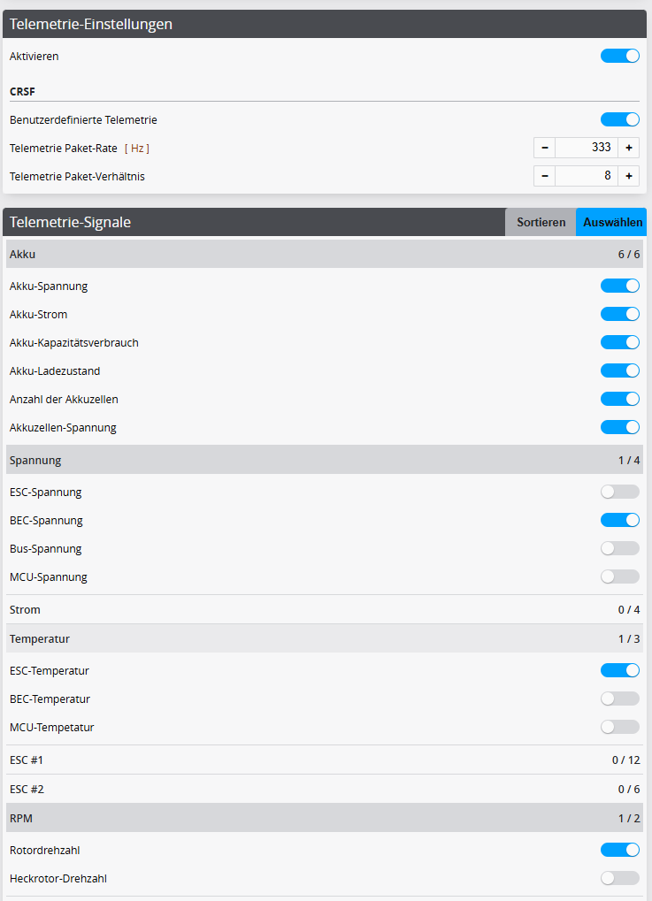
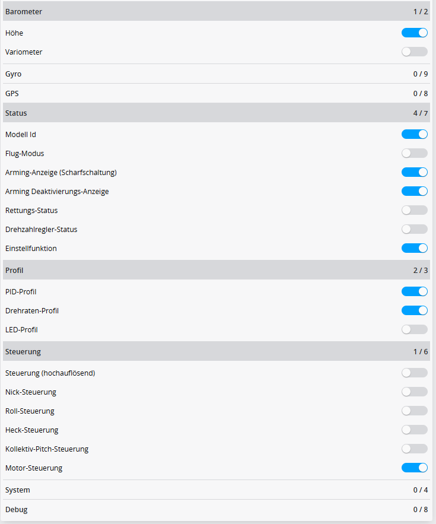
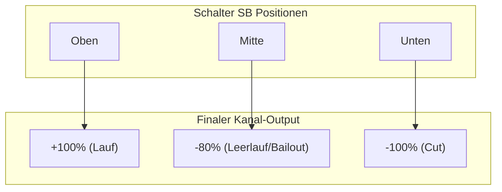
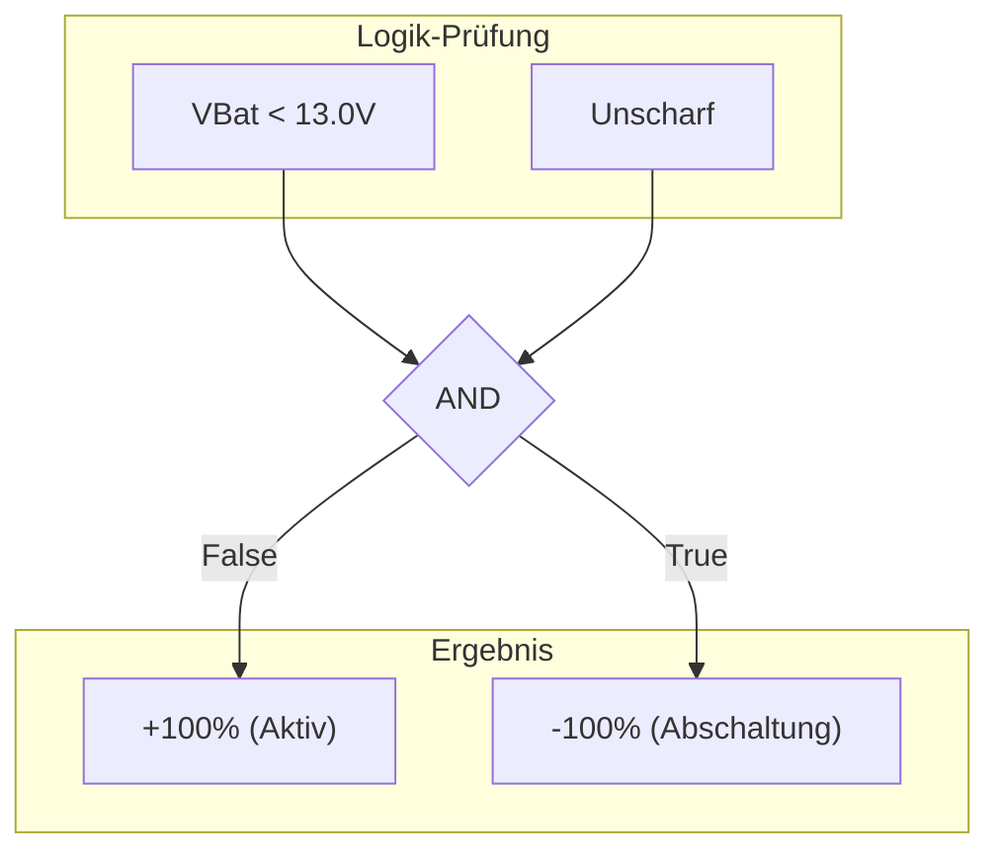
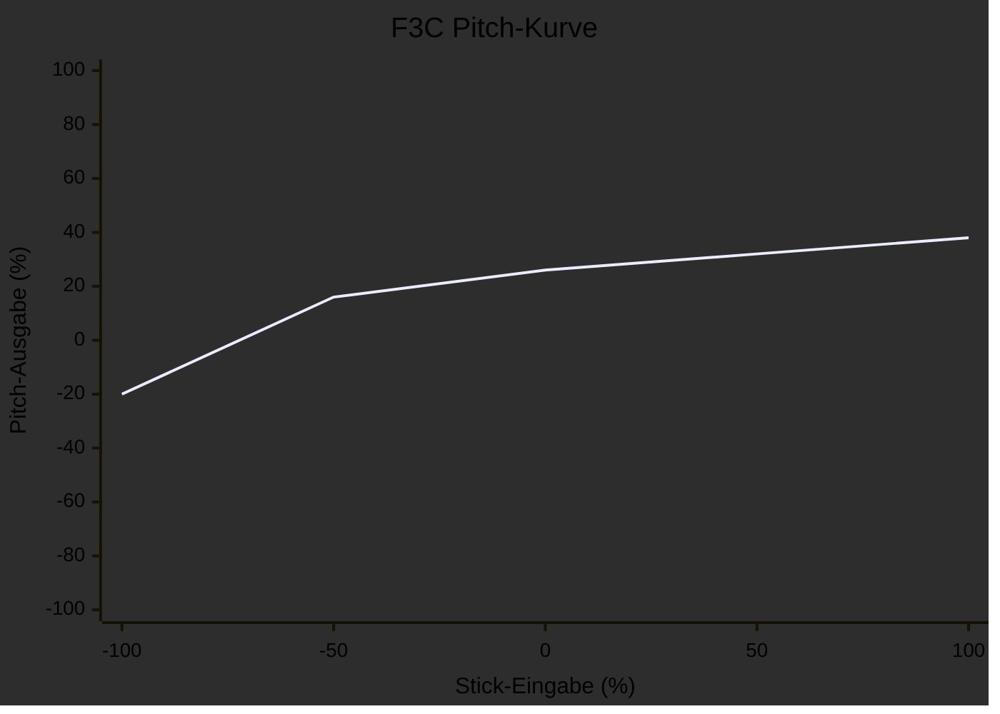

# EdgeTX Rotorflight Telemetrie-Widget

[English](README.md) | [Deutsch](README.de.md)

Dieses Repository stellt ein spezialisiertes Telemetrie-Widget für **Rotorflight 2** zur Verfügung, das für EdgeTX-Sender entwickelt wurde. Es konzentriert sich ausschließlich auf flugrelevante Daten und enthält ein komplettes Setup-Paket mit Sounddateien und einer Modellvorlage.

**Basiert auf:** [RF2-dashboards von Offer Shmuely](https://github.com/offer-shmuely/RF2-dashboards).

## Voraussetzungen

Stellen Sie vor der Installation sicher, dass Sie die offiziellen Lua-Skripte in der Version >= 2.3.0 installiert haben:
* [Rotorflight Lua Scripts Releases](https://github.com/rotorflight/rotorflight-lua-scripts/releases)

---

## 1. Installation (Dateien)

1.  Laden Sie dieses Repository herunter (Code -> Download ZIP).
2.  Verbinden Sie Ihren EdgeTX-Sender per USB (SD-Karten-Modus) oder stecken Sie die SD-Karte in Ihren PC.
3.  Kopieren Sie den **Inhalt** des `SD`-Ordners aus diesem Repository direkt in das Stammverzeichnis Ihrer SD-Karte.
    * Dadurch werden die Dateien mit Ihren vorhandenen Ordnern (`WIDGETS`, `SOUNDS`, `MODELS`, `IMAGES`) zusammengeführt.
4.  **Wichtig:** Nach einem Neustart Ihres Senders finden Sie in Ihrer Modellauswahl ein neues Modell mit dem Namen **"Rotorflight"**.

    !EdgeTX model

---

## 2. Rotorflight-Konfiguration (Flugsteuerung)

Damit das Widget Daten und Namen korrekt anzeigt, müssen Sie die Einstellungen im **Rotorflight Configurator** anpassen.

### Allgemeine Einstellungen
1.  Öffnen Sie die Rotorflight 2 Lua-Anwendung oder den Configurator.
    
    !EdgeTX tools menu

2.  Gehen Sie zum Reiter **Settings**.
    
    !EdgeTX main menu

3.  Aktivieren Sie die Seite **Model**.
    
    !EdgeTX model settings

4.  **Wichtig:** Stellen Sie auf der Seite "Model" die Option "Set name on TX" auf **ON**.

### Einstellungs-Parameter
Konfigurieren Sie die Parameter, um Anpassungen vom Sender aus zu ermöglichen:
* **Param1:** Setzen Sie den Typ auf `TIMER1` und den Wert auf Ihre gewünschte Timer-Zeit in Sekunden.
* **Param2:** Setzen Sie den Typ auf `GV1`. Dies wird verwendet, um die Höhe (Mitte) der F3C-Schwebe-Kurve anzupassen.

  !EdgeTX tools menu

### Telemetrie-Einstellungen (CRSF)
Damit das Widget die richtigen Daten empfängt:
1.  Stellen Sie die CRSF-Telemetrie auf **Custom**.
2.  Stellen Sie sicher, dass die Paketrate mit Ihren ELRS/Crossfire-Einstellungen übereinstimmt.
3.  **Erforderliche Sensoren:** Sie MÜSSEN die folgenden Telemetriesignale aktivieren, damit das Widget funktioniert:
    * **Akku:** Spannung, Strom, Kapazität, Zellenzahl, Durchschnittliche Zellenspannung.
    * **Status:** Arming-Flags, Governor-Status, etc.
    * **Profil:** PID-Profil, Raten-Profil.
    * **Drehzahl:** Kopf-Drehzahl (RPM).
    * **Temperaturen:** ESC/MCU (falls verfügbar).

 

---

## 3. EdgeTX Sender-Setup

### Modellvorlage
Sie können die bereitgestellte `.yml`-Datei aus dem `MODELS`-Ordner als Basis laden. Das neue Modell heißt "Rotorflight".

**⚠️ VORSICHT:** Überprüfen Sie immer Mischer und Ausgänge, bevor Sie Ihren Helikopter mit Strom versorgen! Jedes mechanische Setup ist anders.

### Standard-Schalterbelegung
Das Widget und das Modell sind mit dem folgenden Layout vorkonfiguriert:

| Funktion | Schalter | Beschreibung |
| :--- | :--- | :--- |
| **Bänke/Raten** | `SC` | Profil 1 (Schweben), 2 (Acro), 3 (3D) |
| **Rettung** | `SF` | Rettungsmodus-Aktivierung  |
| **Gas-Hold/Cut** | `SB` | Gas-Hold / Autorotation  |
| **Scharfschalten** | `SE` | Motor scharfschalten  |
| **F3C / F3N** | `6-Pos` | Schaltet zwischen F3C / F3N Pitch-Kurve in der ersten Flugphase (Schweben). Die Höhe der F3C-Kurve wird mit GV1 angepasst. |

### Kanalzuordnung
Die bereitgestellte Modellvorlage verwendet die folgende Kanalreihenfolge. Stellen Sie sicher, dass diese mit Ihrem **Receiver**-Tab in Rotorflight übereinstimmen.

| Kanal | Funktion | Beschreibung |
| :--- | :--- | :--- |
| **CH1** | Roll | Querruder |
| **CH2** | Nick | Höhenruder |
| **CH3** | Pitch | Kollektiver Pitch |
| **CH4** | Yaw | Seitenruder |
| **CH5** | Arm | Arming-Signal |
| **CH6** | Motor | Gas-Signal |
| **CH7** | Bank | Bank-Auswahl |
| **CH8** | Rescue | Rettungs-Aktivierung |
| **CH9** | Puffer | Backup / Puffer (logikgesteuert) |

### Gas-Kanal-Logik (Spezialfunktion)
Der Gaskanal (CH6) verfügt über eine spezielle Konfiguration auf der **Input**-Seite (Offset -90%) in Kombination mit dem **Mischer** (Gewicht 200%, Offset 100%). Diese Logik bildet den 3-Positionen-Schalter **SB** auf drei verschiedene Motorzustände ab:

1.  **SB Unten (Cut):** Der Input wird extrem niedrig angesteuert. Der Mischer begrenzt dies auf **-100%**. -> **Motor AUS / Unscharf**.
2.  **SB Mitte (Autorotation):** Der -90% Input-Offset führt zu einem Mischer-Output von **-80%**. -> **Motor Leerlauf / Bailout scharf**.
    *   *Hinweis:* Dies ermöglicht es Rotorflight, "Throttle Hold" für eine schnelle Hochlauf-Wiederherstellung (Bailout) zu erkennen, die sich von einem kompletten Cut unterscheidet.
3.  **SB Oben (Run):** Der Input wird positiv. Der Mischer steuert dies auf **+100%**. -> **Motor läuft**.

### Anpassen der Schalter
Wenn Sie die Schalterzuweisung ändern möchten (z.B. Schalter tauschen oder Richtung umkehren), gehen Sie zum **INPUTS**-Tab auf Ihrem Sender.

!Inputs Setup

* **Um einen Schalter zu ändern:** Bearbeiten Sie die Input-Zeile und ändern Sie die **Source** (Quelle).
* **Um einen Schalter umzukehren:** Invertieren Sie das Signal in den Input-Einstellungen.

### Puffer-Logik (Kanal 9)
Kanal 9 ist so konfiguriert, dass er einen Backup-Puffer (z.B. R2 Prototyping) mit einer automatischen Abschaltfunktion steuert.

1.  **Normalbetrieb:** Der Kanal gibt **+100%** aus. Der Puffer ist aktiv und wird geladen.
2.  **Abschaltung:** Der Kanal gibt **-100%** aus. Der Puffer schaltet sich aus.

**Logik:**
Der Sender überwacht die Spannung (`VBat`) per Telemetrie.
*   Wenn **VBat < 13.0V** (Hauptakku getrennt)
*   **UND** das Modell ist **Unscharf**
*   -> Das System überschreibt Kanal 9 auf **-100%**, um den Puffer abzuschalten.

*Hinweis:* Dies stellt sicher, dass der Puffer im Flug (Scharf) aktiv bleibt, auch wenn das BEC ausfällt, sich aber automatisch ausschaltet, wenn Sie den Akku am Boden abstecken.

---

## 4. Anpassung (Bilder & Sounds)

Dieses Widget verwendet dynamisches Laden von Dateien basierend auf dem Namen Ihres Modells in Rotorflight.
!ERotorfligt Modelname

### Modellbilder
Das Widget kann ein Bild Ihres Helikopters anzeigen.
1.  Erstellen Sie ein PNG-Bild mit einer Auflösung von **192x114 Pixeln**.
2.  Benennen Sie die Datei exakt nach Ihrem **"Model Name"** in Rotorflight.
    * *Beispiel:* Wenn der RF-Modellname "Goosky RS7" ist, muss das Bild `IMAGES/Goosky RS7.png` heißen.
3.  Legen Sie es im `IMAGES`-Ordner ab.
    * *Ressource:* SkyRaccoon.com.

### Sprachansagen
Das Widget spielt einen Willkommens-Sound ab, wenn das Modell geladen wird.
1.  Erstellen Sie eine WAV-Datei (32kHz, 16-Bit, Mono).
2.  Benennen Sie sie exakt nach Ihrem **"Model Name"** in Rotorflight mit der Erweiterung `.wav`.
3.  Legen Sie sie im `SOUNDS/RF2/`-Ordner ab.
    * *Werkzeug:* TTSAutomate.

---

## 5. Widget-Einstellungen

Sie können das Aussehen und Verhalten des Widgets direkt im Einstellungsmenü des EdgeTX-Widgets anpassen. Drücken Sie lange auf das Widget, um die Einstellungen aufzurufen.

| Option | Beschreibung |
| :--- | :--- |
| **Textfarbe** | Passen Sie die primäre Textfarbe des Widgets an. |
| **Audio-Ansagen aktivieren** | **AN:** Spielt Sprachwarnungen für Scharf/Unscharf und niedrigen Akku ab. |
| **Akku-Ansage alle 10%** | **AN:** Spielt eine Akkuwarnung bei jedem 10%-Schritt des Verbrauchs ab (z.B. 90%, 80%, 70%...). Wenn deaktiviert, erfolgen Warnungen nur bei 50% und 30%. |
| **Haptische Ansagen aktivieren** | **AN:** Lässt den Sender bei Warnungen vor niedrigem Akku vibrieren (auch wenn der Ton aus ist). |
| **Autorotations-Profil** | Wählen Sie das Raten-Profil, das für die Autorotation verwendet wird. Wenn dieses Profil aktiv ist, wird "Autorotation" anstelle der Profilnummer angesagt. |

---

## 6. F3C-Pitch-Kurve

In der ersten Flugphase (Schweben) schaltet der 6-Positionen-Schalter zwischen einer standardmäßigen linearen Pitch-Kurve (F3N) und einer speziellen F3C-Schwebe-Kurve um. Der Mittelpunkt (Höhe) der F3C-Kurve kann im Flug mit **GV1** angepasst werden.

## Lizenz

Dieses Projekt ist unter der **GNU General Public License v3.0** lizenziert.
Basiert auf der Arbeit von Offer Shmuely.