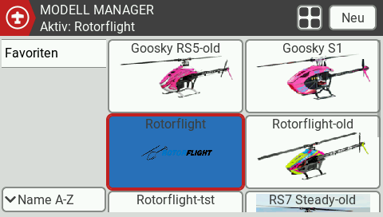
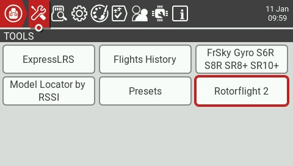
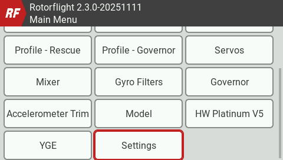
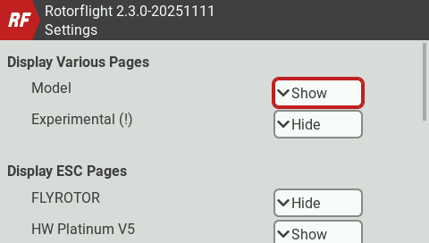
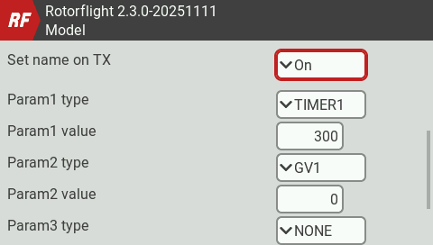
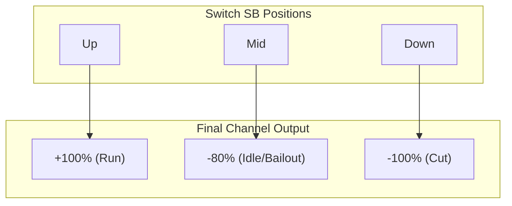
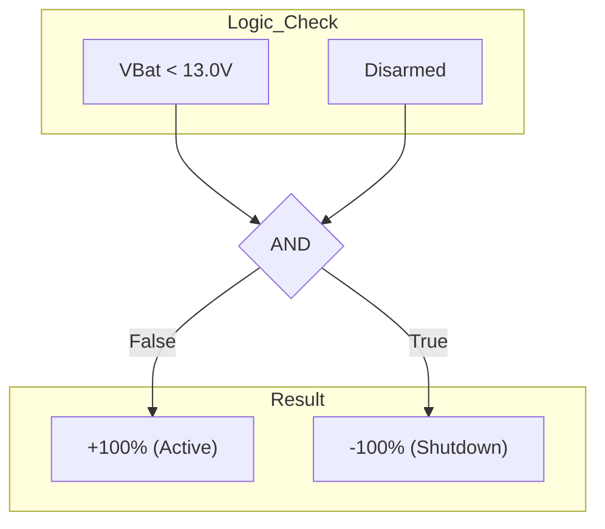
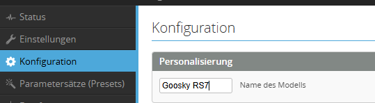
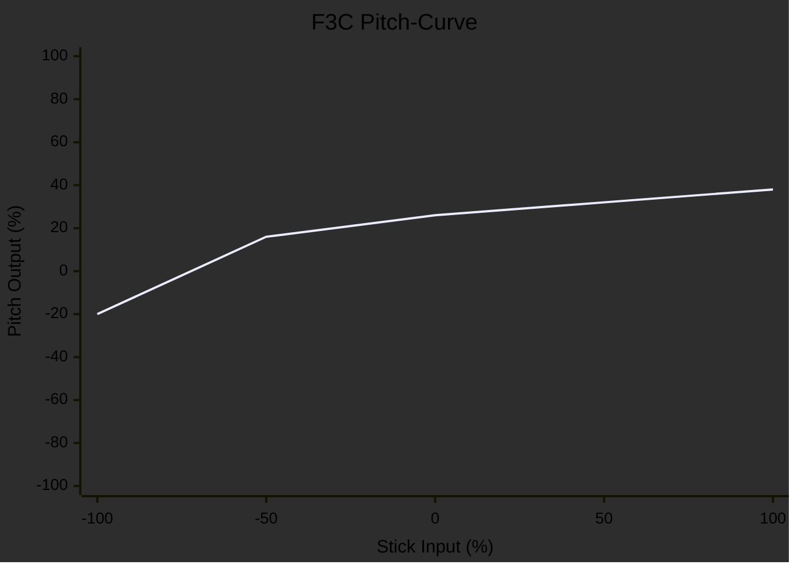

# EdgeTX Rotorflight Telemetry Widget

[English](README.md) | [Deutsch](README.de.md)

---

This repository provides a specialized telemetry widget for **Rotorflight 2**, designed for EdgeTX radios. It focuses purely on flight-relevant data and includes a complete setup pack with sound files and a model template.

**Based on:** [RF2-dashboards by Offer Shmuely](https://github.com/offer-shmuely/RF2-dashboards).

## Prerequisites

Before installing, ensure you have the official Lua scripts installed Version >= 2.3.0:
* [Rotorflight Lua Scripts Releases](https://github.com/rotorflight/rotorflight-lua-scripts/releases)

---

## 1. Installation (Files)

1.  Download this repository (Code -> Download ZIP).
2.  Connect your EdgeTX radio via USB (SD Card Mode) or insert the SD card into your PC.
3.  Copy the **contents** of the `SD` folder from this repository directly to the root of your SD card.
    * This will merge with your existing folders (`WIDGETS`, `SOUNDS`, `MODELS`, `IMAGES`).
4.  **Important:** After restarting your radio, you will find a new model in your model selection list named **"Rotorflight"**.

    

---

## 2. Rotorflight Configuration (Flight Controller)

To ensure the widget displays data and names correctly, you must adjust settings in the **Rotorflight Configurator**.

### General Settings
1.  Open the Rotorflight 2 Lua application or Configurator.
    
    

2.  Go to the **Settings** tab.
    
    

3.  Enable the **Model** page.
    
    

4.  **Important:** Under the Model page, set "Set name on TX" to **ON**.

### Adjustment Parameters
Configure the parameters to allow adjustments from the radio:
* **Param1:** Set type to `TIMER1` and value to your desired timer time in seconds.
* **Param2:** Set type to `GV1`. This is used to adjust the height (center) of the F3C hover curve.

  

### Telemetry Settings (CRSF)
For the widget to receive the correct data:
1.  Set CRSF Telemetry to **Custom**.
2.  Ensure the Packet Rate matches your ELRS/Crossfire settings.
3.  **Required Sensors:** You MUST enable the following telemetry signals for the widget to work:
    * **Battery:** Voltage, Current, Capacity, Cell count, Average Cell Voltage.
    * **Status:** Arming flags, Governor status, etc.
    * **Profile:** PID Profile, Rate Profile.
    * **RPM:** Head speed (RPM).
    * **Temperatures:** ESC/MCU (if available).

 

---

## 3. EdgeTX Radio Setup

### Model Template
You can load the provided `.yml` file from the `MODELS` folder as a base. The new model is named "Rotorflight".

**⚠️ CAUTION:** Always check Mixer and Outputs before powering your helicopter! Every mechanical setup is different.

### Default Switch Assignment
The widget and model are pre-configured with the following layout:

| Function | Switch | Description |
| :--- | :--- | :--- |
| **Banks/Rates** | `SC` | Profile 1 (Hover), 2 (Acro), 3 (3D) |
| **Rescue** | `SF` | Rescue mode activation  |
| **Throttle/Cut** | `SB` | Throttle Hold / Autorotation  |
| **Arming** | `SE` | Motor Arming  |
| **F3C / F3N** | `6-Pos` | Switches between F3C / F3N pitch curve in the first flight phase (Hover). The height of the F3C curve is adjusted with GV1. |

### Channel Mapping
The provided model template uses the following channel order. Ensure these match your **Receiver** tab in Rotorflight.

| Channel | Function | Description |
| :--- | :--- | :--- |
| **CH1** | Roll | Aileron |
| **CH2** | Nick | Elevator |
| **CH3** | Pitch | Collective Pitch |
| **CH4** | Yaw | Rudder |
| **CH5** | Arm | Arming Signal |
| **CH6** | Motor | Throttle Signal |
| **CH7** | Bank | Bank Selection |
| **CH8** | Rescue | Rescue Activation |
| **CH9** | Buffer | Backup / Buffer (Logic controlled) |

### Throttle Channel Logic (Special Feature)
The Throttle channel (CH6) features a special configuration on the **Input** side (Offset -90%) combined with the **Mixer** (Weight 200%, Offset 100%). This logic maps the 3-position switch **SB** to three distinct motor states:

1.  **SB Down (Cut):** Input is driven extremely low. The Mixer clamps this to **-100%**. -> **Motor OFF / Disarmed**.
2.  **SB Middle (Autorotation):** The -90% Input offset results in a Mixer output of **-80%**. -> **Motor Idle / Bailout Armed**.
    *   *Note:* This allows Rotorflight to detect "Throttle Hold" for fast spool-up (Bailout) recovery, distinct from a complete cut.
3.  **SB Up (Run):** The Input becomes positive. The Mixer drives this to **+100%**. -> **Motor Run**.

### Customizing Switches
If you want to change the switch assignment (e.g. swap switches or reverse direction), go to the **INPUTS** tab on your radio.

* **To change a switch:** Edit the input line and change the **Source**.
* **To reverse a switch:** Invert the signal in the input settings.

### Buffer Logic (Channel 9)
Channel 9 is configured to control a backup buffer (e.g. R2 Prototyping) with an automatic shutdown feature.

1.  **Normal Operation:** The channel outputs **+100%**. The buffer is active and charging.
2.  **Shutdown:** The channel outputs **-100%**. The buffer turns off.

**Logic:**
The radio monitors the Voltage (`VBat`) via telemetry.
*   If **VBat < 13.0V** (Main battery disconnected)
*   **AND** the model is **Disarmed**
*   -> The system overrides Channel 9 to **-100%** to shut down the buffer.

*Note:* This ensures the buffer remains active in flight (Armed) even if the BEC fails, but turns off automatically when you unplug the battery on the ground.

---

## 4. Customization (Images & Sounds)

This widget uses dynamic file loading based on your model's name in Rotorflight.

### Model Images
The widget can display a picture of your helicopter.
1.  Create a PNG image with resolution **192x114 pixels**.
2.  Name the file exactly matching your **"Model Name"** in Rotorflight.
    * *Example:* If RF Model Name is "Goosky RS7", the image must be `IMAGES/Goosky RS7.png`.
3.  Place it in the `IMAGES` folder.
    * *Resource:* [SkyRaccoon.com](https://www.skyraccoon.com/).

### Voice Announcements
The widget plays a welcome sound when the model loads.
1.  Create a WAV file (32kHz, 16-bit, Mono).
2.  Name it exactly matching your **"Model Name"** in Rotorflight with the extension `.wav`.
3.  Place it in the `SOUNDS/RF2/` folder.
    * *Tool:* [TTSAutomate](https://ttsautomate.com/).

---

## 5. Widget Settings

You can customize the widget appearance and behavior directly in the EdgeTX widget settings menu. Long-press the widget to enter the settings.

| Option | Description |
| :--- | :--- |
| **Show Total Voltage** | **OFF:** Shows average cell voltage (e.g., 3.8V).   **ON:** Shows total pack voltage (e.g., 22.8V). |
| **GUI Style** | Choose between different visual styles:   **1-Fancy:** Graphical gauges.   **2-Modern:** Clean modern design. |
| **Max Current** | Set the maximum current (Amps) for the graphical bar scaling. |
| **Max ESC Temp** | Set the maximum ESC temperature (°C) for the graphical bar scaling. |
| **Text Color** | Customize the primary text color of the widget. |
| **Enable Audio Announcements** | **ON:** Plays voice alerts for Arm/Disarm and low battery. |
| **Enable Haptic Announcements** | **ON:** Vibrates the radio on low battery warnings (even if audio is off). |
| **Autorotation Profile** | Select the Rate Profile used for Autorotation. When this profile is active, "Autorotation" is announced instead of the profile number. |

---

## 6. F3C pitch curve

In the first flight phase (Hover), the 6-position switch toggles between a standard linear pitch curve (F3N) and a special F3C hover curve. The center point (height) of the F3C curve can be adjusted in-flight using **GV1**.

## License

This project is licensed under the **GNU General Public License v3.0**.
Based on work by Offer Shmuely.